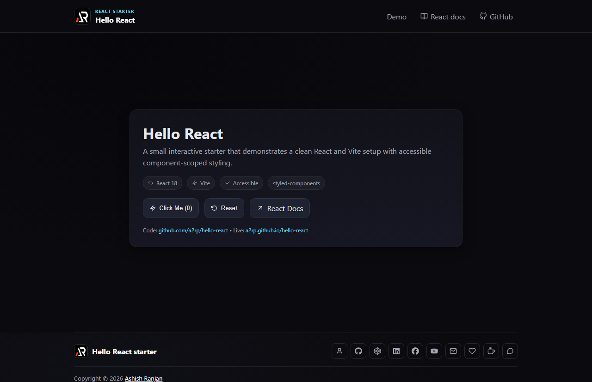

# Hello React



A small React and Vite starter that demonstrates an interactive counter, accessible controls, component-scoped styling, and a responsive project shell.

## Features

- Interactive counter with reset control
- React documentation and source links
- Fixed branded header with a small-screen menu
- Focus-visible controls and responsive layout
- Icon-only developer and support links in the footer
- Floating scroll-to-top control

## Tech Stack

React, Vite, styled-components, and react-icons.

## Run locally

```bash
npm install
npm run dev
```

## Deployment

```bash
npm run build
npm run deploy
```

Live app: [https://a2rp.github.io/hello-react/](https://a2rp.github.io/hello-react/)

## Links

- Portfolio: [https://www.ashishranjan.net](https://www.ashishranjan.net)
- GitHub: [https://github.com/a2rp](https://github.com/a2rp)
- CodePen: [https://codepen.io/ash1198](https://codepen.io/ash1198)
- LinkedIn: [https://www.linkedin.com/in/aashishranjan](https://www.linkedin.com/in/aashishranjan)
- Facebook: [https://www.facebook.com/theash.ashish/](https://www.facebook.com/theash.ashish/)
- YouTube: [https://www.youtube.com/@ashishranjan-ashz?sub_confirmation=1](https://www.youtube.com/@ashishranjan-ashz?sub_confirmation=1)
- Email: [ash.ranjan09@gmail.com](mailto:ash.ranjan09@gmail.com)

## Support

- Support: [https://a2rp-donation-page.netlify.app/](https://a2rp-donation-page.netlify.app/)
- Buy Me A Coffee: [https://buymeacoffee.com/a2rp](https://buymeacoffee.com/a2rp)
- Patreon: [https://patreon.com/a2rp](https://patreon.com/a2rp)
